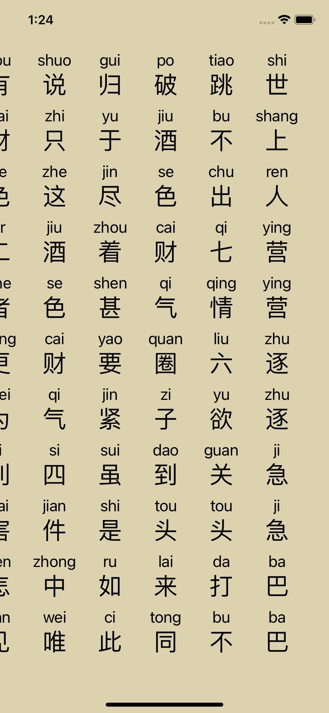

# react-native-quick-pinyin

A module parses chinese to pinyin characters for React Native purely through JSI binding.

<a href="./docs/screenshot.png">
  
</a>

## Installation

```sh
$ npm install react-native-quick-pinyin
# or yarn add react-native-quick-pinyin
```

## Usage

```javascript
import Pinyin from "react-native-quick-pinyin";

Pinyin.getFullChars('你好')
// nihao
```

Also, you can check the [example](./example).

## Interface

```typescript
interface QuickPinyin {
  getFullChars: (text: string) => string;
}
```

## Contributing

See the [contributing guide](CONTRIBUTING.md) to learn how to contribute to the repository and the development workflow.

## License

MIT
